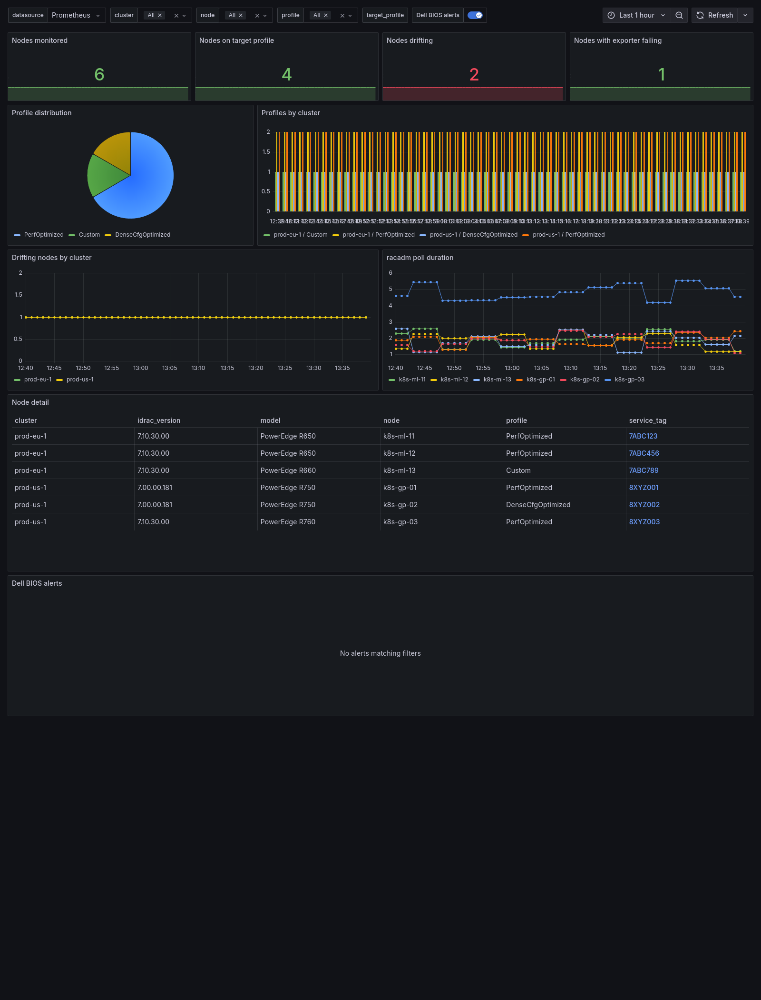

# dell-bios-profile-exporter

[](https://github.com/cicdteam/dell-bios-profile-exporter/actions/workflows/ci.yml)
[](LICENSE)
[](exporter/go.mod)
[](https://github.com/cicdteam/dell-bios-profile-exporter/releases/latest)

A Prometheus-compatible exporter and Helm chart that monitor the BIOS
**System Profile** attribute on Dell PowerEdge servers via the host-local
`racadm` utility (through the iDRAC Service Module), and alert when it drifts
from a target value (default `PerfOptimized`).

## What it does

A DaemonSet runs a small Go exporter on each selected node. On every poll the
exporter calls `racadm` inside the host PID and mount namespaces via `nsenter`,
reads the `BIOS.SysProfileSettings.SysProfile` attribute, caches it (poll
interval default 60s), and serves it as Prometheus metrics on port 9101. A small
amount of static inventory (Service Tag, model, iDRAC version) is refreshed on a
slower interval and attached as labels.

An alert fires when the current profile drifts from the configured target
(default `PerfOptimized`), when the exporter cannot read the value, or when the
last successful read is too old. Because everything goes through the host-local
iDRAC Service Module, the exporter needs **no network access to iDRAC and no
credentials**: it talks to the local management interface the same way an
on-host administrator would.

## Architecture

```
DaemonSet pod --nsenter--> host racadm --iSM (KCS/USB-NIC)--> iDRAC --> BIOS
```

Why this way: querying iDRAC over the network with Redfish would require iDRAC
credentials stored in the cluster and network reach from worker nodes into the
management plane, both of which are commonly disallowed and were deliberately
avoided here. The `syscfg` tool (from Dell's deployment toolkit) is not generally
packaged for Ubuntu, so it is not a portable option. Host-local `racadm` talking
to the iDRAC Service Module uses the in-band channel (KCS or the internal USB
NIC) that the iDRAC Service Module already maintains on the host, so it needs no
network path to the BMC and no secrets at all. The exporter simply enters the
host namespaces and runs the same `racadm` the node administrator would run.

## Requirements

- Kubernetes 1.24+.
- Helm 3.x or 4.x.
- On each target node:
  - A Dell PowerEdge server, 12th generation (12G) or newer.
  - The iDRAC Service Module installed (`dcism`), with its daemon `dcismeng`
    running and connected to the iDRAC.
  - The `racadm` binary available on the host (default path
    `/opt/dell/srvadmin/sbin/racadm`).
- One monitoring stack already running in the cluster, either
  kube-prometheus-stack (Prometheus Operator) or k8s-victoria-metrics-stack
  (VictoriaMetrics Operator).

## Contents

- `exporter/` - the Go exporter (DaemonSet container).
- `chart/` - the Helm chart (DaemonSet, monitoring CRDs, alerts, dashboard).
- `examples/` - ready-made values for common setups.
- `scripts/verify.sh` - runs lint/template/unit/kubeconform checks.

## Build the image

```bash
cd exporter
docker build --platform linux/amd64 --build-arg VERSION=0.1.5 \
  -t ghcr.io/cicdteam/dell-bios-profile-exporter:0.1.5 .
```

## Test the chart without installing

The chart works with both Helm 3.x and Helm 4.x.

```bash
helm lint chart/
helm template chart/
helm unittest chart/
./scripts/verify.sh
```

Note: under Helm 4 the helm-unittest plugin installs with
`helm plugin install https://github.com/helm-unittest/helm-unittest --verify=false`.

## Install in an air-gapped environment

```bash
# On a connected host, pull the published chart from the OCI registry:
helm pull oci://ghcr.io/cicdteam/charts/dell-bios-profile-exporter --version 0.1.5
# copy dell-bios-profile-exporter-0.1.5.tgz into the closed network, then:
helm install dell-bios ./dell-bios-profile-exporter-0.1.5.tgz -f my-values.yaml
```
The container image must be mirrored into the private registry separately
(for example with `docker save` / `skopeo copy` into your internal registry).

## Metrics

| Metric | Type | Labels | Meaning |
| --- | --- | --- | --- |
| `dell_bios_sys_profile_info` | gauge (=1) | `node`, `profile`, `service_tag`, `model`, `idrac_version` | Info metric; the current profile value is carried in the `profile` label. |
| `dell_bios_sys_profile_matches_target` | gauge | `node`, `target` | `1` if the current profile equals the target, else `0`. |
| `dell_bios_racadm_success` | gauge | `node` | `1` if the last poll succeeded, `0` if it failed. |
| `dell_bios_racadm_duration_seconds` | gauge | `node` | Duration of the last `racadm` call, in seconds. |
| `dell_bios_racadm_errors_total` | counter | `node`, `reason` (`timeout`, `exit_code`, `parse_error`, `nsenter_failed`) | Count of failed `racadm` calls by reason. |
| `dell_bios_last_scrape_timestamp_seconds` | gauge | `node` | Unix time of the last successful poll. |
| `dell_bios_exporter_build_info` | gauge (=1) | `version`, `go_version` | Build information for the running exporter. |

## Grafana dashboard

The chart ships a Grafana dashboard (`chart/dashboards/dell-bios-profile.json`),
auto-discovered by the Grafana sidecar when `dashboard.enabled=true`. It shows
node counts (monitored / on-target / drifting / exporter-failing), profile
distribution, per-cluster breakdowns and a per-node detail table. Screenshot
below uses synthetic data:



For node prerequisites (installing iSM and racadm), chart installation,
configuration, alerts, the Grafana dashboard and troubleshooting, see
`chart/README.md`. Russian: `README.rus.md`.
